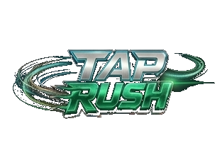

<p align="center">
  
</p>

<h1 align="center">TAP RUSH</h1>

<p align="center">
  <strong>A competitive mobile tapping game by Reyeso Studio</strong>
</p>

<p align="center">
  
  
  
  
</p>

<p align="center">
  
  
  
</p>

---

## 🎮 About

**Tap Rush** is a fast-paced competitive tapping game built for the [Skillz](https://www.skillz.com/) platform. Players tap spawning neon targets for points within a 60-second match, dodging decoys, building combos, and surviving the Chaos Finale.

> 🏆 **Win real prizes** competing against other players worldwide through Skillz tournaments.

---

## ✨ Features

| Feature | Description |
|---------|-------------|
| 🎯 **Precision Tapping** | Tap neon targets with closest-to-finger hit detection |
| 🔥 **Combo System** | Build streaks for multipliers (x1.2 at 5, x1.5 at 10) |
| ⚡ **Gauge Power-Up** | Hit the cyan orb 8 times for 2x score multiplier |
| 💀 **Chaos Finale** | Last 15 seconds — slow-mo intro, red flood, screen effects |
| 🎵 **Dynamic Audio** | Musical pentatonic taps, combo pitch ramp, crossfade music |
| 🌟 **Visual Juice** | Bloom, tap ripples, particle bursts, screen shake, ambient dust |
| 🎬 **Studio Intro** | Reyeso Studio branded video intro |
| 🏆 **Skillz SDK** | Tournament matchmaking, seeded RNG fairness, score submission |
| 📱 **Adaptive Scaling** | Targets scale based on device aspect ratio |
| 🎨 **Premium UI** | Metallic buttons, neon glow, premium typography |

---

## 🚀 Game Flow

```
┌─────────────┐     ┌─────────────┐     ┌─────────────┐     ┌─────────────┐
│   Reyeso    │ ──► │  Main Menu  │ ──► │  GameScene  │ ──► │  End Screen │
│ Studio Intro│     │  Practice / │     │  60s Match  │     │ Final Score │
│             │     │  Compete    │     │  + Chaos    │     │  + Buttons  │
└─────────────┘     └─────────────┘     └─────────────┘     └─────────────┘
                          │                                         │
                          ▼                                         ▼
                    ┌─────────────┐                          ┌─────────────┐
                    │  Skillz UI  │ ◄────────────────────────│Score Submit │
                    │ Tournament  │                          │  to Skillz  │
                    └─────────────┘                          └─────────────┘
```

---

## 🛠️ Tech Stack

- **Engine:** Unity 6.5 (6000.5.4f1)
- **Rendering:** Universal Render Pipeline (URP) 2D
- **Audio:** Dynamic music system with crossfade + pentatonic tap feedback
- **Competition:** Skillz SDK 2025.0.50 (Android)
- **RNG:** Deterministic seeded System.Random (Phase 4.5 verified)
- **Build:** IL2CPP, ARM64, Release-signed with custom keystore
- **Target:** Android (min SDK 24)

---

## 📁 Project Structure

```
Assets/
├── Scripts/           # Core gameplay (20+ scripts)
│   ├── GameManager.cs         # Scoring, combos, power-ups
│   ├── TargetSpawner.cs       # Seeded spawning, chaos mode
│   ├── AudioManager.cs        # Dynamic music + SFX system
│   ├── UIManager.cs           # Premium HUD + end screen
│   ├── ScreenFX.cs            # Post-processing reactions
│   ├── SkillzMatchController.cs  # SDK bridge
│   ├── LoadingScreen.cs       # Transition screen
│   └── ...
├── Scenes/            # IntroScene, MainMenu, GameScene, EndScreen
├── Resources/         # Logo, button images, sprites
├── Video/             # Studio intro video
├── Audio/             # SFX clips
├── Fonts/             # Orbitron (futuristic typeface)
└── Skillz/            # SDK (imported)
```

---

## 👥 Team

<table>
  <tr>
    <td align="center"><strong>🎨 Calo</strong><br/>Creative Director<br/>Gameplay Design<br/>Unity Editor<br/><em>Reyeso Studio</em></td>
    <td align="center"><strong>🧠 Clue</strong><br/>Strategy & Architecture<br/>SDK Integration<br/>Code Review<br/><em>AI Agent (VPS)</em></td>
    <td align="center"><strong>⚡ Copilot CLI</strong><br/>Implementation<br/>Audio/Visual Polish<br/>Build Engineering<br/><em>AI Agent (Mac)</em></td>
  </tr>
</table>

---

## 🏗️ Build & Run

### Prerequisites
- Unity 6000.5.4f1 with Android Build Support
- Android SDK (included with Unity)
- Release keystore (not in repo — contact team)

### Build APK
1. Open project in Unity
2. File → Build Settings → Android
3. Build (keystore auto-configured in Player Settings)

### Install on Device
```bash
adb install -r Builds/TapRush_Release.apk
```

---

## 📋 Roadmap

- [x] **Phase 1:** Foundation (Unity + Skillz setup)
- [x] **Phase 2:** Core Gameplay (scoring, combos, targets)
- [x] **Phase 3:** Juice & Polish (audio, visuals, particles)
- [x] **Phase 4:** Chaos Finale (last 15s intensity)
- [x] **Phase 4.5:** Deterministic RNG (Skillz fairness)
- [x] **Phase 5:** Skillz SDK Integration
- [ ] **Phase 6:** Monetization Testing
- [ ] **Phase 7:** Skillz Store Submission
- [ ] **Phase 8:** Marketing & Scale
- [ ] **Phase 9:** Tap Rush 2.0

---

## 📄 License

Proprietary — © 2026 Reyeso Studio. All rights reserved.

---

<p align="center">
  <strong>Built with 💚 by Reyeso Studio</strong><br/>
  <em>Powered by Skillz</em>
</p>
